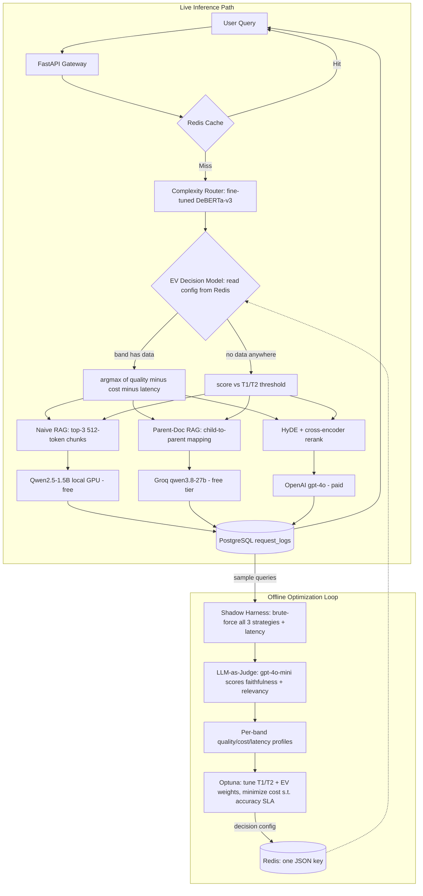

# Meta-RAG: An Adaptive Inference Gateway

A RAG system that **classifies each query's complexity, routes it to the cheapest tier that can answer it well, and re-tunes its own routing thresholds** from production feedback via Bayesian optimization — without a restart.

Most RAG pipelines are static: every query hits the same retriever and the same (usually expensive) model, regardless of whether it's "What is the capital of France?" or a multi-hop reasoning question. Meta-RAG treats routing as a control problem instead.

---

## How it works



The offline loop is the part that makes this more than a router: it replays sampled production queries through **all three** strategies, has an LLM judge score every answer, builds empirical quality/cost/latency profiles per complexity band, then searches for the EV weights (and fallback T1/T2) that minimize cost while holding an accuracy floor. The winning decision config is written to Redis as one atomic JSON blob and picked up by the live gateway on the next request — no restart.

---

## What's actually built and measured

| Component | Implementation | Status |
|---|---|---|
| Complexity router | `microsoft/deberta-v3-base` (183M) + regression head | Trained, **val MSE 0.0067** |
| Training data | 2,000 synthetic queries, balanced 666/666/668 across bands | Generated via `gpt-4o-mini` |
| Corpus | 96 Wikipedia articles (~782k words) | Ingested |
| Embeddings | `all-MiniLM-L6-v2` (384-dim) | — |
| Vector store | Qdrant, 3 isolated collections | 2,314 naive / 2,314 hyde / 8,611 parent child-chunks |
| Cheap tier | `Qwen2.5-1.5B-Instruct` via transformers, local GPU | $0/query |
| Medium tier | Groq `qwen/qwen3.8-27b` | $0/query (free tier) |
| Expensive tier | HyDE + `ms-marco-MiniLM-L-6-v2` rerank → `gpt-4o` | ~$0.004-0.005/query measured |
| Cache | Redis, exact-match SHA-256 keys, 24h TTL | ~1.15ms on hit |
| Logging | PostgreSQL `request_logs` | Per-request route, latency, cost |
| Judge | OpenAI `gpt-4o-mini` | Faithfulness + relevancy, 0.0-1.0 |
| Decision model | EV (quality − λ_cost·cost − λ_latency·latency) per band, Optuna-tuned weights | Beats static thresholds on both cost and accuracy — see below |
| Dashboard | Streamlit + Plotly over `request_logs` | — |
| Tests | 35 passing (`pytest tests/`) | — |

### The closed loop, validated

On a 40-query shadow-eval run (`--samples 40`, real cost ≈$0.20), Optuna tuned both models from the same judge-scored dataset:

| | T1 | T2 | λ_cost | λ_latency | Cost | Accuracy |
|---|---|---|---|---|---|---|
| Static threshold (baseline) | 0.104 | 0.517 | — | — | $0.0747 | 0.912 |
| **EV decision model** | 0.223 | 0.914 (fallback only) | 29.6 | 0.0002 | **$0.0000** | **0.934** |

The EV model doesn't just match the baseline cheaper — it's **strictly better on both axes**: higher accuracy *and* zero cost, because it learned (from judge-scored history, not an assumption) that the free tiers already match GPT-4o's quality on this corpus, so paying for the expensive tier bought nothing. Verified live, not just in the offline replay: the same query ("What is the capital of France?", complexity 0.142) routes `naive`→`parent` purely from the Redis config update, no code change or restart, and deleting the Redis key makes the gateway fall back to deterministic threshold routing with no exceptions. A real production-shaped query at complexity 0.685 — which a static rule would send to `parent` — got routed to `naive` instead, because the EV model's historical data showed `naive` actually performs better for that complexity band on this corpus. That's a genuinely data-driven decision a two-threshold rule structurally cannot make.

The judge also caught a genuine hallucination during an earlier run: the local 1.5B model invented *"David Gauthier"* as the originator of multiple-intelligences theory (it's Howard Gardner), and scored **faithfulness=0.0** for it.

### Measured latency

| Route | Latency |
|---|---|
| Cache hit | ~1.2 ms |
| Parent (Groq) | ~4.3 s |
| HyDE (GPT-4o + rerank) | ~14.4 s |
| Naive (local, cold start) | ~24 s — dominated by one-time model load |

---

## Decision model: from static thresholds to expected value

The original design compared one complexity score to two fixed cutoffs. The current model instead estimates, per query, each tier's **expected value**:

```
EV(tier) = quality(tier) − λ_cost · cost(tier) − λ_latency · latency(tier)
```

where `quality`/`cost`/`latency` are empirical means from judge-scored shadow-eval history — not a trained regression, deliberately: with only dozens of samples, per-band averages are more defensible than a model that would overfit. Historical records are grouped into three **bands** using the *fixed* default thresholds (0.4/0.85) — band membership never moves even as live T1/T2 get retuned, or "accumulate enough samples per band over time" would never converge.

**Hierarchical backoff, not a binary fallback.** If a query's band has ≥3 samples for all three tiers, EV uses band-level stats. Otherwise it falls back to a *global* pool (all bands combined) — with even a few dozen records the global pool already clears that bar for every tier, so EV fires on effectively all traffic from day one. Only with zero historical data anywhere does it fall through to the plain threshold rule, which is what makes this safe for a fresh deployment with no shadow-eval history at all.

**Known limitation, not fixed here:** the Groq "free" tier's cost is hardcoded to $0 because the free tier isn't metered — but it isn't actually free, it shares a real, scarce daily token quota. Since judge-scored quality is often tied near 1.0 across tiers on this corpus, EV frequently prefers the free Groq tier over local generation once quality ties, purely on cost — which could drain that shared quota faster than the old static rule did. Documented here rather than scope-crept into quota modeling.

---

## Setup

Hardware this was built and measured on: **RTX 3050 6GB laptop GPU**, 16GB RAM, Windows 11 Home.

```bash
# 1. Environment
python -m venv .venv
.venv/Scripts/activate        # Windows; use source .venv/bin/activate on Linux

# 2. PyTorch with CUDA — the plain PyPI wheel is CPU-only on Windows.
#    Pick the cuXXX index matching your driver; cu126 was correct here.
pip install torch --index-url https://download.pytorch.org/whl/cu126

# 3. Everything else
pip install -r requirements.txt

# 4. Infrastructure (Docker Desktop required; on Windows Home this needs WSL2)
docker-compose up -d           # Qdrant :6333, Redis :6379, Postgres :5433

# 5. Secrets
cp .env.example .env           # then fill in your API keys
```

> **Postgres is published on host port 5433, not 5432** — a native Postgres install already occupied 5432 on the development machine, and the collision produced a confusing auth failure rather than a clean port-in-use error.

### Running the pipeline

```bash
python -m src.router.generate_synthetic --samples 2000   # build training data
python -m src.router.train                                # fine-tune the router (~135s on RTX 3050)
python -m src.ingestion.fetch_wikipedia                   # pull the corpus
python -m src.ingestion.vector_loader                     # chunk, embed, load all 3 collections

uvicorn src.gateway.main:app --port 8000                  # serve the gateway
streamlit run src/dashboard/app.py                        # ops dashboard

python -m src.eval.shadow_harness --samples 40            # offline: brute-force + judge + latency
python -m src.eval.optimizer --trials 150 --sla 0.90      # offline: tune EV weights + push to Redis
```

```bash
curl -X POST http://localhost:8000/chat \
  -H "Content-Type: application/json" \
  -d '{"query": "How does deforestation affect biodiversity?"}'
# Response headers carry X-Route-Chosen and X-Cache-Hit
```

---

## Engineering decisions worth explaining

**Local tier is `transformers` + Qwen2.5-1.5B, not vLLM + Phi-3.** vLLM is Linux-only, and Phi-3-mini (3.8B) in fp16 needs ~7.5GB — more than the 6GB card has, before accounting for the router, embedder, and cross-encoder that share the same process and VRAM. A 1.5B model in fp16 fits alongside them with headroom.

**Training runs in fp32, not mixed precision.** DeBERTa-v3's checkpoint ships fp16 weights; combining those with bf16 autocast produced exploding gradients (grad norms of 300-800, eval MSE 0.66 — worse than predicting the mean). Forcing fp32 weight loading fixed the math, and dropping autocast entirely sidestepped a `CUBLAS_STATUS_EXECUTION_FAILED` in bf16 GEMM on this GPU. The dataset is small enough that fp32 costs ~135s total.

**The judge runs on OpenAI, not Groq.** `groq/compound-mini` silently proxies to `llama-3.3-70b-versatile`, which carries its own 100k-tokens/day account-wide cap. Because the judge fires 3× per harness query *and* the parent tier used the same model, they exhausted that shared budget mid-run. Moving the judge off Groq decoupled them.

**Wikipedia ingestion fetches one article per request.** The MediaWiki API silently caps full-text extracts at `exlimit=1`; batching titles returns one article's text and empty extracts for the rest, which looks like "article not found" rather than a limit.

**`dispatch()`'s tier lookup table is rebuilt on every call, not cached at module level.** A module-level `{"naive": (retrieve_naive, generate_local), ...}` dict captures direct references to those functions at import time; `monkeypatch.setattr(dispatcher, "generate_local", fake_fn)` replaces the *module attribute*, which a dict built once at import time never sees again. Three dispatcher tests silently called the real (GPU-loading) functions instead of their mocks until this was caught. Rebuilding the dict inside the function body makes the lookup resolve the current module globals at call time, same as the bare-name calls it replaced.

## Known limitations

These are deliberate scope cuts, not oversights:

- **The cache is exact-match, not semantic.** Real traffic phrases the same question many ways, so the true hit rate would be well below what semantic matching would deliver.
- **The nightly loop isn't scheduled.** `shadow_harness` and `optimizer` are run manually; there's no Celery Beat / cron wiring yet.
- **Shadow-eval samples are small** (12-40, not the 200/night the design targets), because brute-forcing every strategy means paying for a GPT-4o call per query per run.
- **The Groq "free" tier's cost isn't really zero** (see the Decision model section) — EV currently has no way to account for shared-quota scarcity, only $-cost.
- **`shadow_harness` overwrites, not appends**, so every run replaces the dataset rather than accumulating it; a real deployment would want append + de-dup.
- **No horizontal scaling.** Every worker process loads its own copy of all four models into VRAM. Production would need a shared model server (vLLM/Triton) behind the gateway.
- **Cost savings are measured on this corpus and sample**, not extrapolated to a traffic profile. The EV model's "$0 cost" result reflects a 40-query sample where the free tiers sufficed — not a claim about production economics at scale.

## Testing

```bash
pytest tests/ -v    # 35 tests
```

Covers chunker token-boundary invariants (size limits, overlap correctness, no gaps), the trained router's band ordering on held-out queries, threshold→strategy mapping at exact boundaries, cost/accuracy aggregation, the EV decision model (band-level firing, global-pool fallback, threshold fallback), Redis decision-config fallback (empty/unreachable/populated), and the Groq retry helper's backoff behavior. Router tests skip cleanly if the model hasn't been trained, since `models/router/` is gitignored.

One subtlety worth knowing if you're reading `tests/test_dispatcher.py`: those tests call `dispatch(query, t1=.., t2=..)` with both thresholds pinned explicitly, which deliberately skips Redis entirely — this keeps them deterministic regardless of what a local optimizer run has pushed. `dispatch(query)` with no explicit thresholds is what actually exercises the EV path.

## Layout

```
src/
├── router/       generate_synthetic.py · train.py · predict.py
├── ingestion/    fetch_wikipedia.py · chunker.py · embedder.py · vector_loader.py
├── gateway/      main.py · dispatcher.py · schemas.py
├── eval/         shadow_harness.py · judge.py · optimizer.py · decision_model.py · routing_rules.py
├── dashboard/    app.py
└── utils/        config.py · cache.py · logger.py · groq_retry.py
```
