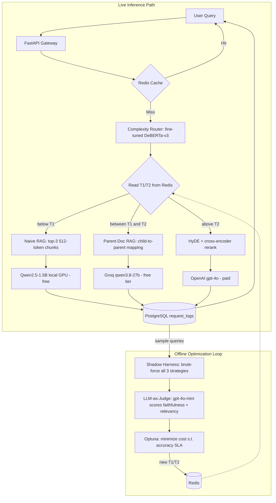

# Meta-RAG: An Adaptive Inference Gateway

A RAG system that **classifies each query's complexity, routes it to the cheapest tier that can answer it well, and re-tunes its own routing thresholds** from production feedback via Bayesian optimization — without a restart.

Most RAG pipelines are static: every query hits the same retriever and the same (usually expensive) model, regardless of whether it's "What is the capital of France?" or a multi-hop reasoning question. Meta-RAG treats routing as a control problem instead.

---

## How it works



The offline loop is the part that makes this more than a router: it replays sampled production queries through **all three** strategies, has an LLM judge score every answer, then searches the threshold space for the split that minimizes cost while holding an accuracy floor. The winning thresholds are written to Redis and picked up by the live gateway on the next request.

---

## What's actually built and measured

| Component | Implementation | Status |
|---|---|---|
| Complexity router | `microsoft/deberta-v3-base` (183M) + regression head | Trained, **val MSE 0.0067** |
| Training data | 2,000 synthetic queries, balanced 666/666/668 across bands | Generated via `gpt-4o-mini` |
| Corpus | 96 Wikipedia articles (~782k words) | Ingested |
| Embeddings | `all-MiniLM-L6-v2` (384-dim) | — |
| Vector store | Qdrant, 3 isolated collections | 2,314 naive / 2,314 hyde / 8,611 parent child-chunks |
| Cheap tier | `Qwen2.5-1.5B-Instruct` via transformers, local GPU | $0/query |
| Medium tier | Groq `qwen/qwen3.8-27b` | $0/query (free tier) |
| Expensive tier | HyDE + `ms-marco-MiniLM-L-6-v2` rerank → `gpt-4o` | ~$0.004-0.005/query measured |
| Cache | Redis, exact-match SHA-256 keys, 24h TTL | ~1.15ms on hit |
| Logging | PostgreSQL `request_logs` | Per-request route, latency, cost |
| Judge | OpenAI `gpt-4o-mini` | Faithfulness + relevancy, 0.0-1.0 |
| Optimizer | Optuna, 50 trials over T1/T2 | Validated end-to-end |
| Dashboard | Streamlit + Plotly over `request_logs` | — |
| Tests | 26 passing (`pytest tests/`) | — |

### The closed loop, validated

On a 12-query shadow-eval run, the optimizer selected **T1=0.107, T2=0.919** — achieving **91.7% average accuracy at $0 cost**, because on that sample the free Groq tier answered as well as GPT-4o, so paying for the expensive tier bought nothing. The same query (`"What is the capital of France?"`, complexity 0.142) then demonstrably re-routed from `naive` to `parent` purely from the Redis update, with no code change or restart.

The judge also caught a genuine hallucination during that run: the local 1.5B model invented *"David Gauthier"* as the originator of multiple-intelligences theory (it's Howard Gardner), and scored **faithfulness=0.0** for it.

### Measured latency

| Route | Latency |
|---|---|
| Cache hit | ~1.2 ms |
| Parent (Groq) | ~4.3 s |
| HyDE (GPT-4o + rerank) | ~14.4 s |
| Naive (local, cold start) | ~24 s — dominated by one-time model load |

---

## Setup

Hardware this was built and measured on: **RTX 3050 6GB laptop GPU**, 16GB RAM, Windows 11 Home.

```bash
# 1. Environment
python -m venv .venv
.venv/Scripts/activate        # Windows; use source .venv/bin/activate on Linux

# 2. PyTorch with CUDA — the plain PyPI wheel is CPU-only on Windows.
#    Pick the cuXXX index matching your driver; cu126 was correct here.
pip install torch --index-url https://download.pytorch.org/whl/cu126

# 3. Everything else
pip install -r requirements.txt

# 4. Infrastructure (Docker Desktop required; on Windows Home this needs WSL2)
docker-compose up -d           # Qdrant :6333, Redis :6379, Postgres :5433

# 5. Secrets
cp .env.example .env           # then fill in your API keys
```

> **Postgres is published on host port 5433, not 5432** — a native Postgres install already occupied 5432 on the development machine, and the collision produced a confusing auth failure rather than a clean port-in-use error.

### Running the pipeline

```bash
python -m src.router.generate_synthetic --samples 2000   # build training data
python -m src.router.train                                # fine-tune the router (~135s on RTX 3050)
python -m src.ingestion.fetch_wikipedia                   # pull the corpus
python -m src.ingestion.vector_loader                     # chunk, embed, load all 3 collections

uvicorn src.gateway.main:app --port 8000                  # serve the gateway
streamlit run src/dashboard/app.py                        # ops dashboard

python -m src.eval.shadow_harness --samples 20            # offline: brute-force + judge
python -m src.eval.optimizer --trials 50 --sla 0.90       # offline: tune + push to Redis
```

```bash
curl -X POST http://localhost:8000/chat \
  -H "Content-Type: application/json" \
  -d '{"query": "How does deforestation affect biodiversity?"}'
# Response headers carry X-Route-Chosen and X-Cache-Hit
```

---

## Engineering decisions worth explaining

**Local tier is `transformers` + Qwen2.5-1.5B, not vLLM + Phi-3.** vLLM is Linux-only, and Phi-3-mini (3.8B) in fp16 needs ~7.5GB — more than the 6GB card has, before accounting for the router, embedder, and cross-encoder that share the same process and VRAM. A 1.5B model in fp16 fits alongside them with headroom.

**Training runs in fp32, not mixed precision.** DeBERTa-v3's checkpoint ships fp16 weights; combining those with bf16 autocast produced exploding gradients (grad norms of 300-800, eval MSE 0.66 — worse than predicting the mean). Forcing fp32 weight loading fixed the math, and dropping autocast entirely sidestepped a `CUBLAS_STATUS_EXECUTION_FAILED` in bf16 GEMM on this GPU. The dataset is small enough that fp32 costs ~135s total.

**The judge runs on OpenAI, not Groq.** `groq/compound-mini` silently proxies to `llama-3.3-70b-versatile`, which carries its own 100k-tokens/day account-wide cap. Because the judge fires 3× per harness query *and* the parent tier used the same model, they exhausted that shared budget mid-run. Moving the judge off Groq decoupled them.

**Wikipedia ingestion fetches one article per request.** The MediaWiki API silently caps full-text extracts at `exlimit=1`; batching titles returns one article's text and empty extracts for the rest, which looks like "article not found" rather than a limit.

## Known limitations

These are deliberate scope cuts, not oversights:

- **The cache is exact-match, not semantic.** Real traffic phrases the same question many ways, so the true hit rate would be well below what semantic matching would deliver.
- **The nightly loop isn't scheduled.** `shadow_harness` and `optimizer` are run manually; there's no Celery Beat / cron wiring yet.
- **Shadow-eval samples are small** (12-20, not the 200/night the design targets), because brute-forcing every strategy means paying for a GPT-4o call per query per run.
- **No horizontal scaling.** Every worker process loads its own copy of all four models into VRAM. Production would need a shared model server (vLLM/Triton) behind the gateway.
- **Cost savings are measured on this corpus and sample**, not extrapolated to a traffic profile. The optimizer's "$0 cost" result reflects a 12-query sample where the free tier sufficed — not a claim about production economics.

## Testing

```bash
pytest tests/ -v    # 26 tests
```

Covers chunker token-boundary invariants (size limits, overlap correctness, no gaps), the trained router's band ordering on held-out queries, threshold→strategy mapping at exact boundaries, cost/accuracy aggregation, Redis threshold fallback (empty/unreachable/populated), and the Groq retry helper's backoff behavior. Router tests skip cleanly if the model hasn't been trained, since `models/router/` is gitignored.

## Layout

```
src/
├── router/       generate_synthetic.py · train.py · predict.py
├── ingestion/    fetch_wikipedia.py · chunker.py · embedder.py · vector_loader.py
├── gateway/      main.py · dispatcher.py · schemas.py
├── eval/         shadow_harness.py · judge.py · optimizer.py
├── dashboard/    app.py
└── utils/        config.py · cache.py · logger.py · groq_retry.py
```
